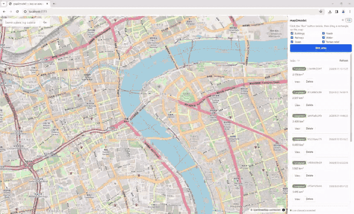

<div align="center">

# map2model

**Draw a box on the map, get a color 2D map and a 3D white-model scene of that area, export to 17 formats, and take them into Blender / AutoCAD / QGIS / Cesium.**


[](https://github.com/lxie-leo/map2model/actions/workflows/ci.yml)

</div>

---

English | [简体中文](README.zh-CN.md)

## Demo



## What is this

A web tool that runs on your own computer. Hold the left mouse button and drag a box on the map; the backend goes off to fetch OpenStreetMap data and terrain elevation for that patch of ground, and about a minute later you can:

- View a **2D color map** — buildings, roads, railways, water and green areas drawn in their own colors, like a proper paper map
- View a **3D white model** — buildings stand up at their real heights, the ground undulates, six layers you can toggle on and off
- **Export to 17 formats** and carry on in whatever software you like

All data comes from free public sources (OSM + AWS terrain tiles). No account, no API keys.

## How it works

```
 draw a box ──► fetch OSM ──► fetch terrain ──► parse ──► build ──► results
     │                                                        │
     │                                          ┌─────────────┼─────────────┐
     │                                          ▼             ▼             ▼
     └── progress streamed live            hub.glb    preview.geojson    meta.json
                                                │             │
                                          3D formats   2D/GIS formats
```

Five steps in total; the web page shows where each one is at, and you can cancel at any time.

## Features

- Drag a box straight on the map, area shown live; boxes that are too big (over 25 km²) get rejected
- Six feature classes with one consistent palette: SVG / PDF are vector and stay sharp at any zoom; PNG / DXF / GeoJSON each serve their own purpose
- Buildings extruded by their `height` tag, estimated from floor count when missing; roads and railways get widths by class; terrain follows AWS elevation data
- Six 3D formats (GLB / OBJ / STL / USDZ / FBX / DAE), four 2D formats (SVG / PDF / PNG / DXF), seven GIS formats (GeoJSON / GPKG / SHP / KML / KMZ / CityJSON / 3D Tiles)
- "Up" is already sorted for you: GLB / USDZ use Y-up (Blender, three.js convention), OBJ / STL / CityJSON use Z-up (CAD convention), and 3D Tiles carry their own georeference — drop them into Cesium and they land in place
- Flaky networks don't leave you hanging: data fetching rotates through mirrors; if terrain can't be fetched at all it falls back to flat ground, tells you why, and the task keeps going
- Progress is pushed over WebSocket, reconnects automatically, and falls back to another channel if WebSocket won't connect at all
- Layer names survive the whole way: nodes inside the GLB are literally named TERRAIN, BUILDING and so on, so they line up with the layer panel in Blender

## Getting started

### Prerequisites

| Software | Version | Why |
| --- | --- | --- |
| Python | ≥ 3.11 (3.12 / 3.13 recommended) | runs the backend |
| Node.js | ≥ 20 | runs the frontend |
| Blender (optional) | any recent version | only needed for FBX / DAE |

### Run it

Two commands on Windows:

```powershell
# 1. Start the backend (first run creates the venv and installs dependencies)
powershell -ExecutionPolicy Bypass -File scripts\dev-backend.ps1

# 2. In another window, start the frontend
powershell -ExecutionPolicy Bypass -File scripts\dev-frontend.ps1
```

Open **http://127.0.0.1:5173**, drag a box, hit "Generate".

> Hate two windows? Run `scripts\run_all.ps1`. Not sure your environment is complete? Run `scripts\check_env.ps1` first.

### Run with Docker (optional)

```bash
docker compose up -d --build
# open http://localhost:8080
```

Everything generated is stored under `./data`, so it survives container rebuilds.

### Desktop app for Windows (optional)

Don't want to set up Python and Node at all? Grab the desktop build from [Releases](../../releases): unzip, double-click `map2model.exe`, done. It opens in its own window, all 17 export formats included (FBX / DAE light up automatically if Blender is installed on that machine — something the Docker image can't do).

A few things worth knowing:

- The exe is not code-signed, so the first launch shows Windows SmartScreen: click **More info → Run anyway**.
- Blender installed somewhere the auto-detect doesn't look (it checks `PATH` and `C:\Program Files\Blender Foundation\`)? Create a `map2model.env` file next to the exe with `M2M_BLENDER_PATH=D:\Blender\blender.exe` — see `desktop/map2model.env.example` for the knobs.
- Your data (database, task outputs, logs) lives in `%LOCALAPPDATA%\map2model`. Delete that folder to reset everything.
- The app needs internet access — it fetches map data and terrain tiles from the network, like the web version does.
- Clicking Download opens a save-file dialog, starting in your system Downloads folder.
- If the system lacks the WebView2 runtime (rare on Windows 10/11), the app falls back to opening in your default browser instead.

To build the exe yourself from source: `powershell -ExecutionPolicy Bypass -File desktop\build-desktop.ps1 -Smoke -Zip`.

## Export formats

| Group | Format | Status | Good for |
| --- | --- | :-: | --- |
| 3D | **GLB** | ✅ | the default choice. Opens directly in Blender and three.js, layer names included |
| 3D | OBJ | ✅ | universal in modeling tools, Z-up |
| 3D | STL | ✅ | 3D printing, millimeters |
| 3D | USDZ | ✅ | send to an iPhone, preview in AR with the Files app |
| 3D | FBX | ⚠️ needs Blender | Unity / Unreal / Maya |
| 3D | DAE | ⚠️ needs Blender | classic 3D interchange format |
| 2D | SVG | ✅ | vector map, scale it as much as you like |
| 2D | PDF | ✅ | printing |
| 2D | PNG | ✅ | image snapshot |
| 2D | DXF | ✅ | AutoCAD, layers pre-sorted as `M2M_*` |
| GIS | GeoJSON | ✅ | the most universal vector format, everything reads it |
| GIS | GPKG | ✅ | multiple layers in one file, opens straight in QGIS / ArcGIS |
| GIS | SHP | ✅ | traditional GIS format, zipped per layer |
| GIS | KML / KMZ | ✅ | Google Earth, buildings extruded |
| GIS | CityJSON | ✅ | city modeling standard (version 2.0) |
| GIS | 3D Tiles | ✅ | big scenes in Cesium, georeferenced |

✅ = works out of the box; ⚠️ = you need Blender installed (the program looks under `C:\Program Files\Blender Foundation\` by itself; on other platforms set `M2M_BLENDER_PATH`).

Buttons in the UI tell the truth about availability: usable ones are lit, the rest are grey, and hovering tells you what's missing.

## Layers and colors

The six layers use the same names and colors in 2D and 3D:

| Layer | Color | Notes |
| --- | --- | --- |
| Terrain | `#c8c3ba` | the ground (undulates when elevation data is available) |
| Green | `#b7d6a8` | parks, grass, woods |
| Water | `#a8cfe8` | rivers, lakes |
| Building | `#ded7cb` | buildings, extruded to real or estimated heights |
| Road | `#a8a8a8` | roads, main and side roads get different widths |
| Railway | `#6b6f73` | railways |

## Configuration

It runs with zero configuration. To tweak, set these environment variables (all prefixed `M2M_`):

| Variable | Default | Description |
| --- | --- | --- |
| `M2M_DATA_DIR` | `data` | where the database and generated files live |
| `M2M_OVERPASS_ENDPOINTS` | a built-in list | comma-separated, tried front to back |
| `M2M_MAX_BBOX_AREA_KM2` | `25` | max area per task |
| `M2M_MAX_BUILDINGS` | `20000` | max buildings per task |
| `M2M_TASK_CONCURRENCY` | `2` | how many tasks run at once |
| `M2M_BLENDER_PATH` | `auto` | where Blender is; `auto` = go find it |

Optional extras: `pip install -e ".[gis,usd]"` makes GPKG go through geopandas and USDZ through the official library; `pip install -e ".[dev]"` installs development and test tools. Everything works without them — the UI just reports what's available.

## FAQ

**Q: npm keeps failing with corrupt files?**
On some Windows machines antivirus interferes with npm's unpacking (`TAR_ENTRY_ERROR`, zero-byte files). This project uses pnpm throughout and has no such trouble: `corepack pnpm install`.

**Q: How long does a run take?**
Most time goes to pulling data from Overpass: about a minute for 0.3 km² of urban area, slower the bigger the box. The second run on the same area hits the cache and comes back almost instantly.

**Q: Why is my terrain flat?**
Some networks can't reach AWS terrain tiles; the program then falls back to flat ground and says why in the task's warnings. Use a proxy or another network and it comes back.

**Q: FBX / DAE buttons are grey?**
Those two formats borrow a hand from Blender. [Install Blender](https://www.blender.org/download/) (free) and restart the backend — they light up. The other 15 formats are unaffected.

**Q: The model lies on its side in Blender?**
That's not a bug. "Up" inside a GLB is Y, and Blender straightens it automatically on open. If you imported OBJ (Z-up) and it looks lying down, rotate it manually.

## Development

```powershell
# backend tests (53 cases)
cd backend; .venv\Scripts\python.exe -m pytest -q

# frontend type check + unit tests
cd frontend; corepack pnpm typecheck; corepack pnpm test

# frontend build
cd frontend; corepack pnpm build
```

On Python 3.14: `mapbox-earcut` has no 3.14 package yet, so the program automatically switches to its own triangulation code — same results, just slower. The Docker image is pinned to 3.12 and doesn't have this issue.

## Author

Leo Xie — GIS / 3D / full-stack. Open to custom development and consulting: [742875110@qq.com](mailto:742875110@qq.com) · [GitHub](https://github.com/lxie-leo)

## License

Code is open-sourced under [MIT](LICENSE): use it, change it, ship it commercially — just keep the LICENSE file with it.

One reminder: the maps and models this tool produces come from OpenStreetMap data (ODbL license). Personal use is fine; if you publish or commercially distribute the results, include the OSM attribution (a "© OpenStreetMap contributors" line is enough).
